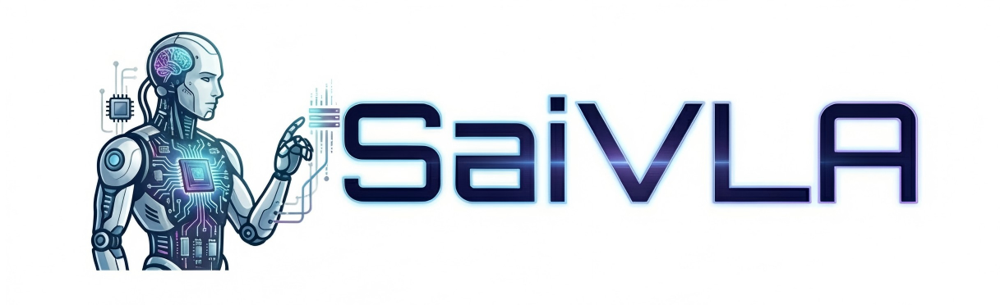

<p align="center">
  
</p>

<h1 align="center">SaiVLA-0: Cerebrum–Pons–Cerebellum Tripartite Architecture for Compute-Aware Vision-Language-Action</h1>

<p align="center">Synthoid.ai</p>

<p align="center">
  <a href="https://solar-flaky-11562614.figma.site"></a>
  <a href="https://huggingface.co/SaiVLA"></a>
  <a href="LICENSE.txt"></a>
</p>

---

## 🧠 Overview

**SaiVLA-0** is a modular Vision-Language-Action (VLA) framework for robotic manipulation, designed to operate efficiently under constrained data and compute budgets.

Inspired by biological sensorimotor organization, SaiVLA-0 separates the control stack into three functional components:

- **Cerebrum** – A frozen large multimodal backbone providing high-level semantic priors  
- **Pons Adapter** – A lightweight semantic-to-control interface  
- **Cerebellum** – A fast multimodal controller optimized for low-latency action execution  

This structured decomposition enables:

- Stable high-frequency control  
- Explicit latency–compute trade-offs  
- Modular backbone and robot upgrades  
- Efficient training via frozen feature reuse  

SaiVLA-0 emphasizes *compute-aware design*, making scheduling, inference frequency, and efficiency transparent and measurable.

---

## ✨ Core Characteristics

- **Tripartite modular architecture** separating reasoning and motor execution  
- **Compute-aware scheduling** with explicit control cadence  
- **Parallel action chunk prediction** for higher effective control frequency  
- **Two-stage training pipeline** improving reproducibility and iteration speed  
- **Geometry-aware perception integration** supporting fine-grained manipulation  

---

## 🎬 Video Demo

<p align="center">
  
</p>


---

## 🔥 News

- **2026-03**: Technical report released.  
- **2026-03**: Evaluation client and LIBERO model weights released.  
- **Upcoming**: Additional model weights and extended benchmarks.  

---

## ⚙️ Quick Start

### Installation

#### 0. Install Python 3.10

```bash
conda create -n saivla python=3.10 -y
conda activate saivla
```

#### 1. Install the LIBERO simulation environment

```bash
pip install mujoco==3.3.7 robosuite==1.4.0 libero==0.1.1
```

#### 2. Install the evaluation client

From source:

```bash
git clone https://github.com/saivla/saivla-0.git
cd sai0-vla-main
pip install -e .
```

---

## 📦 Model Download

| Model | Description | Download |
|-------|------------|----------|
| **SaiVLA-0-LIBERO** | Fine-tuned on LIBERO benchmark | [🤗 HuggingFace](https://huggingface.co/SaiVLA) |
| **SaiVLA-0-Base** | Lightweight tripartite configuration | 🤗 (Coming Soon) |
| **SaiVLA-0-Large** | Extended capacity configuration | 🤗 (Coming Soon) |

---

## 🧪 Evaluation

> **Note:** During the public preview period, no API key is required — you can start evaluating immediately without registration.

### Check server connection

```bash
sai0-eval --server https://api.synthoid.work --check
```

> **Tip:** If you encounter an SSL error (e.g. `WRONG_VERSION_NUMBER`), the server may not support HTTPS. Try using `http://` instead of `https://`.

### Run evaluation

```bash
sai0-eval \
  --server https://api.synthoid.work \
  --task-suite libero_spatial \
  --trials 10 \
  --output-dir ./my_eval_results \
  --save-video
```

> **Note:** If you encounter LIBERO-related errors, configure the proxy settings below and re-run the evaluation command:
>
> ```bash
> unset ALL_PROXY all_proxy
> export HTTP_PROXY="http://127.0.0.1:10808"
> export HTTPS_PROXY="http://127.0.0.1:10808"
> export http_proxy="$HTTP_PROXY"
> export https_proxy="$HTTPS_PROXY"
> ```

### View results

```bash
cat ./my_eval_results/summary.json
ls  ./my_eval_results/videos/
```

---

## 📊 Benchmark Results (LIBERO)

Evaluated under the official LIBERO protocol (averaged over multiple runs):

| Model | Spatial | Object | Goal | Long | Mean |
|-------|--------|--------|------|------|------|
| **SaiVLA-0** | 99.8 | 100.0 | 98.2 | 97.8 | **98.95** |


---

## 🏗️ Architecture

SaiVLA-0 separates local evaluation and cloud inference:

```text
Local Machine                      Cloud GPU Server
┌──────────────┐                  ┌──────────────────┐
│  LIBERO Env  │  obs (img+state) │                  │
│              │ ───────────────► │  /v1/act         │
│  sai0-eval   │                  │  VLA Server      │
│              │ ◄─────────────── │  SaiVLA-0 Model  │
│  Save videos │  actions         │                  │
└──────────────┘                  └──────────────────┘
```

The server handles preprocessing, multimodal fusion, and action decoding.

---

## 🐍 Python API

```python
from sai0_vla_client import Sai0VLAClient

client = Sai0VLAClient("https://api.synthoid.work", api_key="sk-xxx")

actions = client.act(
    images=[agentview_img, wrist_img],   # np.ndarray (H, W, 3)
    state=[...],                         # robot state
    instruction="pick up the red mug",
)
```

---

## 🎯 Design Philosophy

SaiVLA-0 focuses on:

- Separation of semantics and control  
- Efficient iteration under limited data  
- Explicit compute and latency reporting  
- Modular scalability across backbones and robots  

Rather than scaling model size indiscriminately, SaiVLA-0 emphasizes structured system design and reproducibility.

---

## 📜 License

This project is licensed under the Apache License 2.0 — see the `LICENSE.txt` file for details.

---

## 📖 Citation

If you find this work useful, please cite:

```bibtex
@article{saivla0_2026,
  title={SaiVLA-0: Cerebrum--Pons--Cerebellum Tripartite Architecture for Compute-Aware Vision-Language-Action},
  author={Synthoid.ai},
  year={2026}
}
```

---
